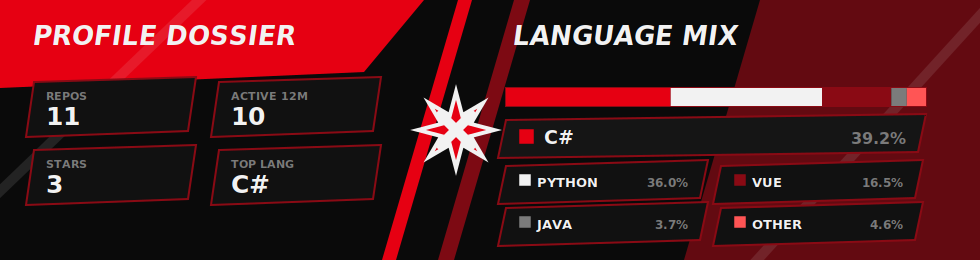

  

  

  

 **MODELS / VISION / AGENTS / TOOLS** · **STORY / MOTION / PLAY / STYLE**

`STEAL THE NOISE` / `SHIP THE SIGNAL`

  

  
  
  
  
  

  
  
  

  

  

  

  

  <picture>
    <source media="(prefers-color-scheme: dark)" srcset="https://raw.githubusercontent.com/Ao-chii/Ao-chii/output/github-contribution-grid-snake-dark.svg?v=2" />
    <source media="(prefers-color-scheme: light)" srcset="https://raw.githubusercontent.com/Ao-chii/Ao-chii/output/github-contribution-grid-snake.svg?v=2" />
    
  </picture>

  

  
  

  

